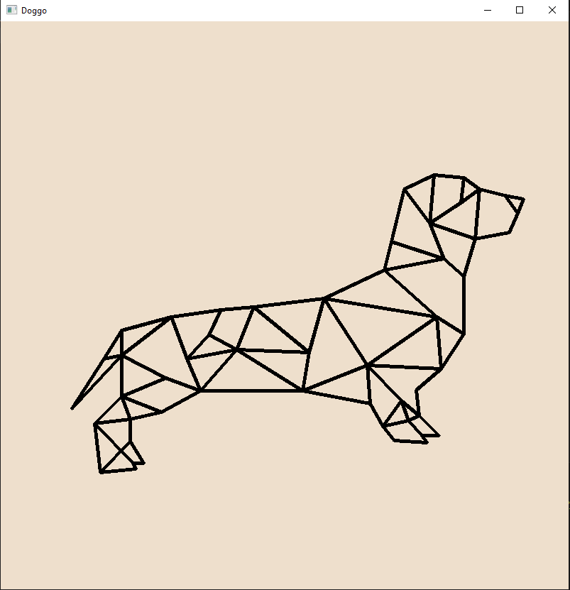

# OpenCV 2D

##2D computer graphics involve creating and manipulating images and shapes in
two dimensions.

2D graphics are used in video games, image editing, computer-aided design
(CAD), and more.

## My code for my doggo in 2D

```python
import cv2
import numpy as np

# Create a black canvas (image)
width, height = 800, 800
canvas = np.zeros((height, width, 3), dtype=np.uint8)
canvas[:, :] = (204,223,238)  # (Blue, Green, Red)


# Define the vertices of the triangle
point1 = (736, 250)  # First point of the triangle
point2 = (710, 245)  # Third point of the triangle
point3 = (674, 236)  # Second point of the triangle
point4 = (652, 220)  # Second point of the triangle
point5 = (610, 216)  # Second point of the triangle
point6 = (568, 236)  # Second point of the triangle
point7 = (550, 310)  # Second point of the triangle
point8 = (540, 350)  # Second point of the triangle
point9 = (455, 390)  # Second point of the triangle
point10 = (356, 402)  # Second point of the triangle
point11 = (310, 406)  # Second point of the triangle
point12 = (240, 416)  # Second point of the triangle
point13 = (170, 435)  # Second point of the triangle
point14 = (145, 475)  # Second point of the triangle
point15 = (100, 545)  # Second point of the triangle
point16 = (170, 470)  # Second point of the triangle
point17 = (170, 528)  # Second point of the triangle
point18 = (132, 566)  # Second point of the triangle
point19 = (140, 635)  # Second point of the triangle
point20 = (190, 630)  # Second point of the triangle
point21 = (186, 622)  # Second point of the triangle
point22 = (201, 622)  # Second point of the triangle
point23 = (182, 591)  # Second point of the triangle
point24 = (182, 560)  # Second point of the triangle
point25 = (226, 550)  # Second point of the triangle
point26 = (281, 520)  # Second point of the triangle
point27 = (425, 520)  # Second point of the triangle
point28 = (520, 538)  # Second point of the triangle
point29 = (538, 570)  # Second point of the triangle
point30 = (554, 590)  # Second point of the triangle
point31 = (600, 593)  # Second point of the triangle
point32 = (593, 583)  # Second point of the triangle
point33 = (617, 583)  # Second point of the triangle
point34 = (589, 555)  # Second point of the triangle
point35 = (585, 519)  # Second point of the triangle
point36 = (620, 489)  # Second point of the triangle
point37 = (652, 440)  # Second point of the triangle
point38 = (652, 359)  # Second point of the triangle
point39 = (668, 306)  # Second point of the triangle
point40 = (716, 297)  # Second point of the triangle
point41 = (728, 270)  # Second point of the triangle

point42 = (648, 255)  # Second point of the triangle
point43 = (604, 284)  # Second point of the triangle
point44 = (624, 334)  # Second point of the triangle
point45 = (614, 416)  # Second point of the triangle
point46 = (516, 484)  # Second point of the triangle
point47 = (564, 534)  # Second point of the triangle
point48 = (574, 562)  # Second point of the triangle
point49 = (434, 466)  # Second point of the triangle
point50 = (332, 462)  # Second point of the triangle
point51 = (293, 441)  # Second point of the triangle
point52 = (262, 475)  # Second point of the triangle
point53 = (232, 502)  # Second point of the triangle


# Draw the triangle on the canvas
cv2.line(canvas, point1, point2, (0, 0, 0), 3)  # Draw line between point1 and point2
cv2.line(canvas, point2, point3, (0, 0, 0), 3)  # Draw line between point2 and point3
cv2.line(canvas, point3, point4, (0, 0, 0), 3)  # Draw line between point2 and point3
cv2.line(canvas, point4, point5, (0, 0, 0), 3)  # Draw line between point2 and point3
cv2.line(canvas, point5, point6, (0, 0, 0), 3)  # Draw line between point2 and point3
cv2.line(canvas, point6, point7, (0, 0, 0), 3)  # Draw line between point2 and point3
cv2.line(canvas, point7, point8, (0, 0, 0), 3)  # Draw line between point2 and point3
cv2.line(canvas, point8, point9, (0, 0, 0), 3)  # Draw line between point2 and point3
cv2.line(canvas, point9, point10, (0, 0, 0), 3)  # Draw line between point2 and point3
cv2.line(canvas, point10, point11, (0, 0, 0), 3)  # Draw line between point2 and point3
cv2.line(canvas, point11, point12, (0, 0, 0), 3)  # Draw line between point2 and point3
cv2.line(canvas, point12, point13, (0, 0, 0), 3)  # Draw line between point2 and point3
cv2.line(canvas, point13, point14, (0, 0, 0), 3)  # Draw line between point2 and point3
cv2.line(canvas, point14, point15, (0, 0, 0), 3)  # Draw line between point2 and point3
cv2.line(canvas, point15, point16, (0, 0, 0), 3)  # Draw line between point2 and point3
cv2.line(canvas, point16, point17, (0, 0, 0), 3)  # Draw line between point2 and point3
cv2.line(canvas, point17, point18, (0, 0, 0), 3)  # Draw line between point2 and point3
cv2.line(canvas, point18, point19, (0, 0, 0), 3)  # Draw line between point2 and point3
cv2.line(canvas, point19, point20, (0, 0, 0), 3)  # Draw line between point2 and point3
cv2.line(canvas, point20, point21, (0, 0, 0), 3)  # Draw line between point2 and point3
cv2.line(canvas, point21, point22, (0, 0, 0), 3)  # Draw line between point2 and point3
cv2.line(canvas, point22, point23, (0, 0, 0), 3)  # Draw line between point2 and point3
cv2.line(canvas, point23, point24, (0, 0, 0), 3)  # Draw line between point2 and point3
cv2.line(canvas, point24, point25, (0, 0, 0), 3)  # Draw line between point2 and point3
cv2.line(canvas, point25, point26, (0, 0, 0), 3)  # Draw line between point2 and point3
cv2.line(canvas, point26, point27, (0, 0, 0), 3)  # Draw line between point2 and point3
cv2.line(canvas, point27, point28, (0, 0, 0), 3)  # Draw line between point2 and point3
cv2.line(canvas, point28, point29, (0, 0, 0), 3)  # Draw line between point2 and point3
cv2.line(canvas, point29, point30, (0, 0, 0), 3)  # Draw line between point2 and point3
cv2.line(canvas, point30, point31, (0, 0, 0), 3)  # Draw line between point2 and point3
cv2.line(canvas, point31, point32, (0, 0, 0), 3)  # Draw line between point2 and point3
cv2.line(canvas, point32, point33, (0, 0, 0), 3)  # Draw line between point2 and point3
cv2.line(canvas, point33, point34, (0, 0, 0), 3)  # Draw line between point2 and point3
cv2.line(canvas, point34, point35, (0, 0, 0), 3)  # Draw line between point2 and point3
cv2.line(canvas, point35, point36, (0, 0, 0), 3)  # Draw line between point2 and point3
cv2.line(canvas, point36, point37, (0, 0, 0), 3)  # Draw line between point2 and point3
cv2.line(canvas, point37, point38, (0, 0, 0), 3)  # Draw line between point2 and point3
cv2.line(canvas, point38, point39, (0, 0, 0), 3)  # Draw line between point2 and point3
cv2.line(canvas, point39, point40, (0, 0, 0), 3)  # Draw line between point2 and point3
cv2.line(canvas, point40, point41, (0, 0, 0), 3)  # Draw line between point2 and point3
cv2.line(canvas, point41, point1, (0, 0, 0), 3)  # Draw line between point2 and point3
cv2.line(canvas, point4, point42, (0, 0, 0), 3)  # Draw line between point2 and point3
cv2.line(canvas, point3, point42, (0, 0, 0), 3)  # Draw line between point2 and point3
cv2.line(canvas, point43, point42, (0, 0, 0), 3)  # Draw line between point2 and point3
cv2.line(canvas, point43, point6, (0, 0, 0), 3)  # Draw line between point2 and point3
cv2.line(canvas, point43, point39, (0, 0, 0), 3)  # Draw line between point2 and point3
cv2.line(canvas, point43, point5, (0, 0, 0), 3)  # Draw line between point2 and point3
cv2.line(canvas, point39, point3, (0, 0, 0), 3)  # Draw line between point2 and point3
cv2.line(canvas, point2, point41, (0, 0, 0), 3)  # Draw line between point2 and point3
cv2.line(canvas, point2, point41, (0, 0, 0), 3)  # Draw line between point2 and point3
cv2.line(canvas, point45, point37, (0, 0, 0), 3)  # Draw line between point2 and point3
cv2.line(canvas, point45, point8, (0, 0, 0), 3)  # Draw line between point2 and point3
cv2.line(canvas, point45, point9, (0, 0, 0), 3)  # Draw line between point2 and point3
cv2.line(canvas, point45, point36, (0, 0, 0), 3)  # Draw line between point2 and point3
cv2.line(canvas, point7, point44, (0, 0, 0), 3)  # Draw line between point2 and point3
cv2.line(canvas, point44, point38, (0, 0, 0), 3)  # Draw line between point2 and point3
cv2.line(canvas, point6, point43, (0, 0, 0), 3)  # Draw line between point2 and point3
cv2.line(canvas, point43, point44, (0, 0, 0), 3)  # Draw line between point2 and point3
cv2.line(canvas, point44, point8, (0, 0, 0), 3)  # Draw line between point2 and point3
cv2.line(canvas, point46, point9, (0, 0, 0), 3)  # Draw line between point2 and point3
cv2.line(canvas, point46, point28, (0, 0, 0), 3)  # Draw line between point2 and point3
cv2.line(canvas, point46, point27, (0, 0, 0), 3)  # Draw line between point2 and point3
cv2.line(canvas, point46, point45, (0, 0, 0), 3)  # Draw line between point2 and point3
cv2.line(canvas, point46, point36, (0, 0, 0), 3)  # Draw line between point2 and point3
cv2.line(canvas, point46, point47, (0, 0, 0), 3)  # Draw line between point2 and point3
cv2.line(canvas, point47, point29, (0, 0, 0), 3)  # Draw line between point2 and point3
cv2.line(canvas, point47, point34, (0, 0, 0), 3)  # Draw line between point2 and point3
cv2.line(canvas, point48, point29, (0, 0, 0), 3)  # Draw line between point2 and point3
cv2.line(canvas, point48, point32, (0, 0, 0), 3)  # Draw line between point2 and point3
cv2.line(canvas, point48, point34, (0, 0, 0), 3)  # Draw line between point2 and point3
cv2.line(canvas, point47, point48, (0, 0, 0), 3)  # Draw line between point2 and point3
cv2.line(canvas, point49, point50, (0, 0, 0), 3)  # Draw line between point2 and point3
cv2.line(canvas, point49, point27, (0, 0, 0), 3)  # Draw line between point2 and point3
cv2.line(canvas, point49, point9, (0, 0, 0), 3)  # Draw line between point2 and point3
cv2.line(canvas, point49, point10, (0, 0, 0), 3)  # Draw line between point2 and point3
cv2.line(canvas, point49, point50, (0, 0, 0), 3)  # Draw line between point2 and point3
cv2.line(canvas, point50, point10, (0, 0, 0), 3)  # Draw line between point2 and point3
cv2.line(canvas, point50, point51, (0, 0, 0), 3)  # Draw line between point2 and point3
cv2.line(canvas, point50, point52, (0, 0, 0), 3)  # Draw line between point2 and point3
cv2.line(canvas, point50, point26, (0, 0, 0), 3)  # Draw line between point2 and point3
cv2.line(canvas, point52, point12, (0, 0, 0), 3)  # Draw line between point2 and point3
cv2.line(canvas, point52, point26, (0, 0, 0), 3)  # Draw line between point2 and point3
cv2.line(canvas, point51, point11, (0, 0, 0), 3)  # Draw line between point2 and point3
cv2.line(canvas, point51, point52, (0, 0, 0), 3)  # Draw line between point2 and point3
cv2.line(canvas, point50, point27, (0, 0, 0), 3)  # Draw line between point2 and point3
cv2.line(canvas, point50, point49, (0, 0, 0), 3)  # Draw line between point2 and point3
cv2.line(canvas, point53, point26, (0, 0, 0), 3)  # Draw line between point2 and point3
cv2.line(canvas, point53, point16, (0, 0, 0), 3)  # Draw line between point2 and point3
cv2.line(canvas, point16, point14, (0, 0, 0), 3)  # Draw line between point2 and point3
cv2.line(canvas, point53, point17, (0, 0, 0), 3)  # Draw line between point2 and point3
cv2.line(canvas, point13, point16, (0, 0, 0), 3)  # Draw line between point2 and point3
cv2.line(canvas, point17, point25, (0, 0, 0), 3)  # Draw line between point2 and point3
cv2.line(canvas, point17, point24, (0, 0, 0), 3)  # Draw line between point2 and point3
cv2.line(canvas, point16, point12, (0, 0, 0), 3)  # Draw line between point2 and point3
cv2.line(canvas, point24, point18, (0, 0, 0), 3)  # Draw line between point2 and point3
cv2.line(canvas, point23, point19, (0, 0, 0), 3)  # Draw line between point2 and point3
cv2.line(canvas, point18, point21, (0, 0, 0), 3)  # Draw line between point2 and point3

# Display the canvas
cv2.imshow("Doggo", canvas)  # Show the canvas with the triangle
cv2.waitKey(0)  # Wait for a key press
cv2.destroyAllWindows()  # Close all windows

```

>Output




