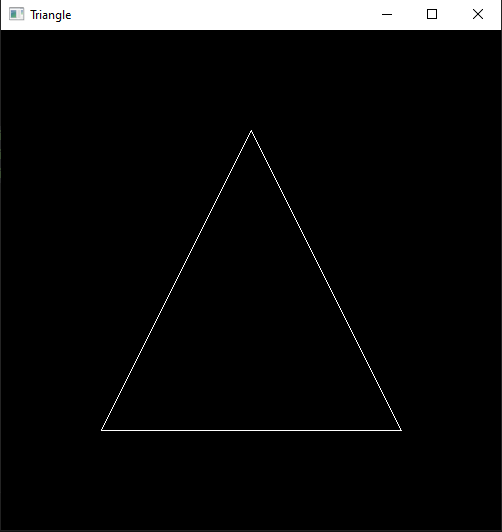
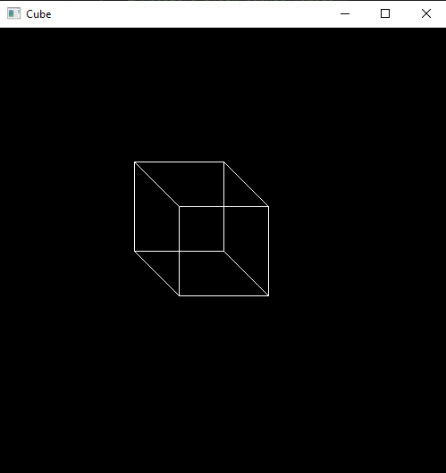

# OpenCV 2D

##2D computer graphics involve creating and manipulating images and shapes in
two dimensions.

2D graphics are used in video games, image editing, computer-aided design
(CAD), and more.

## Sample code to make a triangle

```python
import cv2
import numpy as np

# Create a black canvas (image)
width, height = 500, 500
canvas = np.zeros((height, width, 3), dtype=np.uint8)

# Define the vertices of the triangle
point1 = (250, 100)  # First point of the triangle
point2 = (100, 400)  # Second point of the triangle
point3 = (400, 400)  # Third point of the triangle

# Draw the triangle on the canvas
cv2.line(canvas, point1, point2, (255, 255, 255), 1)  # Draw line between point1 and point2
cv2.line(canvas, point2, point3, (255, 255, 255), 1)  # Draw line between point2 and point3
cv2.line(canvas, point3, point1, (255, 255, 255), 1)  # Draw line between point3 and point1

# Display the canvas
cv2.imshow("Triangle", canvas)  # Show the canvas with the triangle
cv2.waitKey(0)  # Wait for a key press
cv2.destroyAllWindows()  # Close all windows

```

>OUTPUT




## Code for Cube
```python
import cv2
import numpy as np

# Create a black canvas (image)
width, height = 500, 500
canvas = np.zeros((height, width, 3), dtype=np.uint8)

# Define the vertices of the cube
top_left_front = (200, 200)  # Top left vertex of the front face
bottom_right_front = (300, 300)  # Bottom right vertex of the front face
top_left_back = (150, 150)  # Top left vertex of the back face
bottom_right_back = (250, 250)  # Bottom right vertex of the back face

# Draw the front face of the cube
cv2.rectangle(canvas, top_left_front, bottom_right_front, (255, 255, 255), 1)  # Draw a rectangle for the front face

# Draw the back face of the cube
cv2.rectangle(canvas, top_left_back, bottom_right_back, (255, 255, 255), 1)  # Draw a rectangle for the back face

# Connect the corresponding vertices to complete the cube
cv2.line(canvas, top_left_front, top_left_back, (255, 255, 255), 1)  # Connect the top left vertices
cv2.line(canvas, (bottom_right_front[0], top_left_front[1]), (bottom_right_back[0], top_left_back[1]), (255, 255, 255), 1)  # Connect the top right vertices
cv2.line(canvas, (top_left_front[0], bottom_right_front[1]), (top_left_back[0], bottom_right_back[1]), (255, 255, 255), 1)  # Connect the bottom left vertices
cv2.line(canvas, bottom_right_front, bottom_right_back, (255, 255, 255), 1)  # Connect the bottom right vertices

# Display the canvas
cv2.imshow("Cube", canvas)  # Show the canvas with the cube
cv2.waitKey(0)  # Wait for a key press
cv2.destroyAllWindows()  # Close all windows

```

>Output




