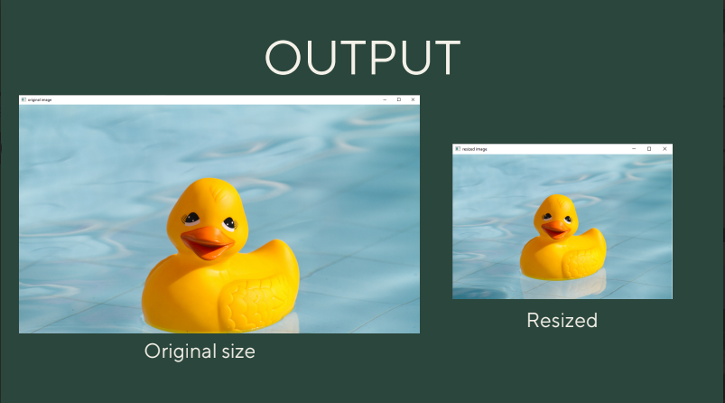
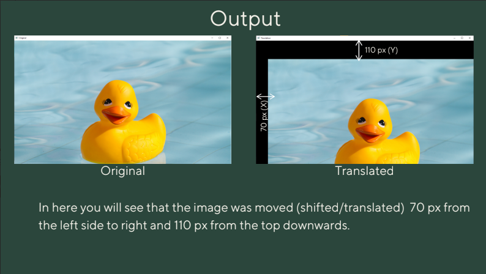
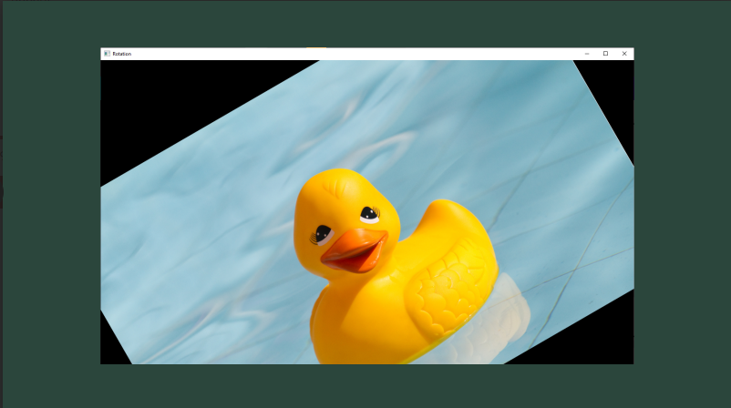

# INTRODUCTION TO GRAPHIC AND VISUAL SYSTEM

### ***Common  Uses for 3D Graphics*** ###

* Real time 3D - Military flight simulators
* Computer Aided Dedsign
* Architectural of civil Planning
* Medical Imaging
* Scientific Visualation
* Entertainment - Games

### ***Computer Graphics*** ###
It is difficult to display an image of any size on the computer
screen. This method is simplified by using Computer graphics. Graphics on
the computer are produced by using various algorithms and techniques.

### ***Basic 3D Programming Principles*** ###
**OpenGL** 

  Low-level rendering API.
You have to put together a model yourself by loading triangles and applying the
necessary transformations as well as the proper textures, shaders, and if necessary
blending modes.

**Coordinate System** – position (x,y)

**2D Cartesian Coordinates**

X coordinate – horizontal direction

Y coordinate – vertical direction

**Origin** x=0,y=0

**Plane** – flat surface
In any coordinate system, two axes (or two lines) that intersect at right angles define a
plane

**Viewport** – is a region within the window’s client area that is
used for drawing a clipping area.
A viewport is defined as twice the size of the clipping area.

**The Vertex** – A position in Space
• Object is composed of smaller shapes called primitives.
• Primitives are one- or two-dimensional entities or surfaces such as
points, lines, and triangles that are assembled in 3D space to create 3D objects.

**Vertex** – coordinate in 2D or 3D space

* 3D Cartesian Coordinates (x,y,z)

* Add a depth (z) in 2D coordinate system.

* Z-axis is perpendicular to both the x- and y-axes.

* Drawn from center to the screen heading toward a viewer.

# SETTING UP YOUR VIRTUAL ENVIRONMENT

A virtual environment is a Python
environment such that the Python interpreter,
libraries and scripts installed into it are
isolated from those installed in other virtual
environments, and (by default) any libraries
installed in a “system” Python, i.e., one
which is installed as part of your operating
system.

### Check Versions ###
    pip install
    pip --version
    python --version

# READING,DISPLAYING, AND SAVING IMAGES

import cv2 img = cv2.imrea('input.jpg')
cv2.imshow('Input image', img)
cv2.waitKey()

If you run the preceding program, you will see an
image being displayed in a new window.

* RGB
* YUV
* HSV

GRAYSCALE

gray_img = cv2.cvtColor(img,cv2.COLOR_BGR2GRAY)

YUV

yuv_img = cv2.cvtColor(img,cv2.COLOR_BGR2YUV)

cv2.imshow('Y channel', yuv_img[:, :, 0])

cv2.imshow('U channel', yuv_img[:, :, 1])

cv2.imshow('V channel', yuv_img[:, :, 2])

cv2.waitKey()

HSV

hsv_img = cv2.cvtColor(img,cv2.COLOR_BGR2HSV)

cv2.imshow('H channel', hsv_img[:, :, 0])

cv2.imshow('S channel', hsv_img[:, :, 1])

cv2.imshow('V channel', hsv_img[:, :, 2])

cv2.waitKey()

# RESIZING, TRANSLATION, AND ROTATION

### RESIZING
To resize an image in Python, you can use cv2. resize() function of OpenCV
library cv2. Resizing, by default, does only change the width and height of the image. The aspect ratio can be preserved or not, based on the requirement.

    This code below will resize your image 

import cv2

import numpy as np

img = cv2.imread ("rduck.png")

res_img = cv2.resize(img, (400, 500))

cv2.imshow("Original Image", img)

cv2.imshow("Resized Image", res_img)

cv2.waitKey(0)

    This will half your scale to resize.

res_img = cv2.resize(img, None, fx = 1/2 , fy = 1/2)

    This code will Find your image size 

import cv2

import numpy as np

img = cv2.imread ("rduck.png")

rows, cols, ch = img.shape

print("height:", rows)

print("width:", cols)

cv2.waitKey(0)

### TRANSLATION
In this section, we will discuss about shifting an image. Let’s say we want to
move the image within our frame of reference. In computer vision
terminology, this is referred to as translation. Let’s go ahead and see how we
can do that

import cv2

import numpy as np

img = cv2.imread("rduck.png")

num_rows, num_cols = img.shape[:2]

translation_matrix = np.float32([ [1,0,70], [0,1,110] ])

img_translation = cv2.warpAffine(img, translation_matrix, (num_cols,num_rows))

cv2.imshow('Translation', img_translation)

cv2.waitKey()

### ROTATION
In this section, we will see how to rotate a given image by a certain angle. We can do it using the following piece of code

import cv2

import numpy as np

img = cv2.imread("rduck.png")

num_rows, num_cols = img.shape[:2]

rotation_matrix = cv2.getRotationMatrix2D((num_cols/2, num_rows/2), 30, 1)

img_rotation = cv2.warpAffine(img, rotation_matrix, (num_cols, num_rows))

cv2.imshow('Rotation'

, img_rotation)

cv2.waitKey()

# NIGGER 